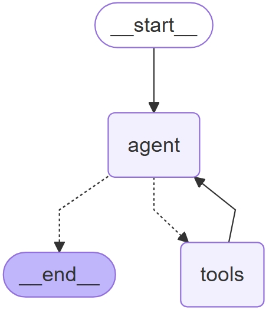

# AI File Management System with LangGraph

An AI-powered file management system built with **LangGraph** that lets you create, edit, rename, and organize files and folders in a sandboxed workspace using **natural language commands**.

## Workflow Diagram
<p align="center">
  
  <br>
  <em>Figure: Workflow diagram of the AI-powered file management agent.</em>
</p>


## 🚀 Features
- Create, edit, and rename files/folders using plain English commands.
- Sandbox environment for safe file operations.
- Interactive command-line interface.

## 🛠️ Installation

1. **Clone this repository**
```bash
git clone https://github.com/abdulsamad183/file_management.git
cd file_management
```

2. **Create and activate a virtual environment and install Dependencies (optional but recommended)**
```bash
python -m venv env
source env/bin/activate  # On Windows: env\Scripts\activate
pip install -r requirements.txt
```
3. **Copy API key in .env**
4. **Run the application**
```bash
python ai.pi
```


## 💡 Contributing

We welcome contributions from everyone! Whether it's fixing a bug, improving documentation, or adding a new feature — your help makes this project better.

### 🐛 Reporting Issues
If you discover a bug or have a suggestion, please [open an issue](../../issues) and describe it clearly.

### ✨ Feature Requests
Got an idea to make this project more awesome? Share your thoughts in the issues section and let's discuss!

### 📦 Pull Requests
- Fork the repository
- Create a new branch for your feature/fix
- Commit your changes with a clear message
- Open a Pull Request and describe your changes

### 💬 Let’s Build Together
If you want to add **new features** or design a **UI**, feel free to jump in and raise a PR.  
Collaboration is what makes open-source thrive — let’s make this project even better together!

   
   
